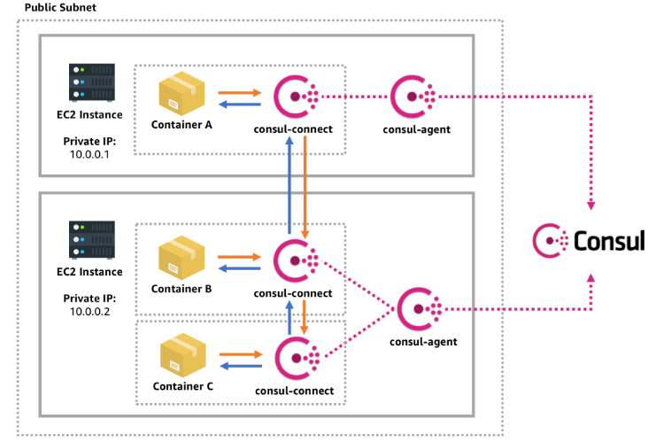

# Service Mesh
https://www.consul.io/docs/connect



## What is service-to-service connections authorization and encryption
- Uses mTLS for authorization and encryption
- Application can contact each other in a usual manner without implementing encryption, certificates management, and access controll all this will done by a sidecar proxy `Envoy` - for example.
    - However application can implement Consul's SDK to use this features without sidecar proxy

- Traffic between apps flow through the sidecar proxy
- Proby enables authencicated and encrypted communication(mTLS) between services. 
- Could provide encryption between services that wouldn't otherwise be encrypted
- Service mesh is platform agnostic. Can connect services on physical network, public cloud, sdn, cross-cloud
- Service Mesh enables Layer 7 observativity. Proxies see all traffic between services and can collect metrics.
- Metrics can be sent to an external monitorin tool, like Prometheus.
- ## Not enabled by default. Need to provide configuration to agent. But enabled in `-dev` mode
## Primary Components of Consul Services Mesh
- `Service Discovery` - Service should be registered in Consul catalog to use service mesh
- `Certificate Authority` - will used to generate certificates for Sidecar Proxy and sign them.
    - Consul has a buil-in CA
    - Possible to use external CA, like Vault, ot any other. 
- `Service` - Service that registered within consul catalog, like DB, or webapp
- `Sidecar` - Additional service running along with main Service and handle all in/out traffic to it. 
    - Can be built-it consul proxy agent or external proxy like `Envoy`
- `Upstream Configuration` - An array of objects that specify the upstream services that the proxy should create listeners for. For example if webservice is depends on DB service, DB will be upstream from webservice and Webservice will be downstream from DB.
    - Upstream - the target service that another service depends on
    - Downstream - the service that is dependent on the target service
- `mTLS Certificates` - Issued by CA, and provided to every service. 
    - Enable encryption between the services
    - Provides authentication by validating the certificates againts the CA
- `Intentions` 
    - Determine what services can establish connections to other services
    - To-down rules using Allow or Deny intentions
    - Can be configured via API, CLI, UI

## High Level Architecture

1. Each application is configured to send trafic to proxy. 
2. Proxy is running along with the service and configured to redirect requests to target service. 
3. All traffic if encrypted with TLS and sended to target service proxy. 
4. Target service proxy decrypt and validate recieved traffic and then redirect it to target service.

## Workflow
1. `Request Connection` - service need to communicate with an upstream service
2. `Connection Handshake` - Service balidates upstream service certificate against the CA bundle
3. `Certification Validation` - Target service validates the downstream certificates against the CA bundle
4. `Intention Check` - Target service validates the incomming connection against the intentions
5. `Connection espablished` - If the intention check succeeds, the connection/request is established. 


## Other components 
1. L7 Traffic Management 
    - "Carved up" traffic across the pool of services vs just using round robin, sometime called traffic splitting
2. Service Mesh Gateways
    - Enables routing between federated service mesh datacenters where private connectivity may not be established or feasible
    - Ingress gateways and termitating gateways(k8s)
3. Observability - Consul 1.9.0 includes new topology visualization to show a service's connectivity.


# Register a Servie Proxy(Sidecar proxy)
https://www.consul.io/docs/connect/registration/sidecar-service
- Just like a service, a sidecat proxy must be registered with Consul. `Registration does not start the sidecar proxy`.

- Registration is most commonly done using a configfile, or API. `Add "connect" section`. By default it will register consul integrated proxy, not Envoy etc. 
```
service {
  name = "dashboard"
  port = 9002

  connect {
    sidecar_service {
      proxy {
        upstreams = [
          {
            destination_name = "counting"
            local_bind_port  = 5000
          }
        ]
      }
    }
  }
}
```

# Intentions 
- Intentions define access controll for Services. Uses a `service graph` to determine what service are allower to establish connections to other services
- Enforced at the destination/target service on inbound connections, proxy request or with a natively integrated app(SDK)
- Default Befaviour is controlled by ACL policy.
- Only one intention controls authoeization at any given time 
- [Intentions Precedence](https://www.consul.io/docs/connect/intentions#precedence-and-match-order)
- Contolling Authorization - Authorization is control using either L4 or L7 depending on the protocol being used.
    - L4 - Identity based(TLS) - all or nothing access controll. Based on new connections. `The only option Supported by consul built-in service proxy`
    - L7 - application-aware - can be based on L7 request attributes. Based on new requests. `Supported by external proxies, like Envoy`

## Create intentions
- Can be configured via API, CLI, UI
- Changing an intentions doen not affects existing connections only new connections 
## `CLI`
[create, check, delete, get, list, match](https://www.consul.io/commands/intention)

### `consul intention`
- get - show info aout intention
- check - validate whether a connection is allower
- create - create a new intention
    - consul intention creaet db web # Allow service DB to reach WEB service
    - consul intention creaet -deny db web # Deny service DB to reach WEB service

- delete - delete an existing
- match - show intention matching a source or dest
- list - list ALL intentions

Managed primarily using the service-intentions config entries or the UI.
1. Create intention definition 
```
Kind = "service-intentions"
Name = "db" # Name of the target service
Sources = [
{
    Name   = "web" # Name of the source service
    Action = "deny" # Action applied on source service
},
{ 
    Name   = "api"  # Name of the source service
    Action = "allow"# Action applied on source service
}
]
```
2. Create using CLI 
```
consul intention create -file one.json 
```
3. Possible to apply multiple files
```
consul intention create -file intentions/*.json
```

